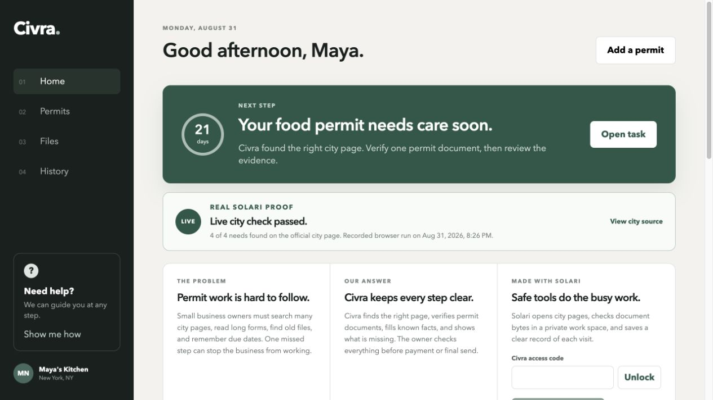
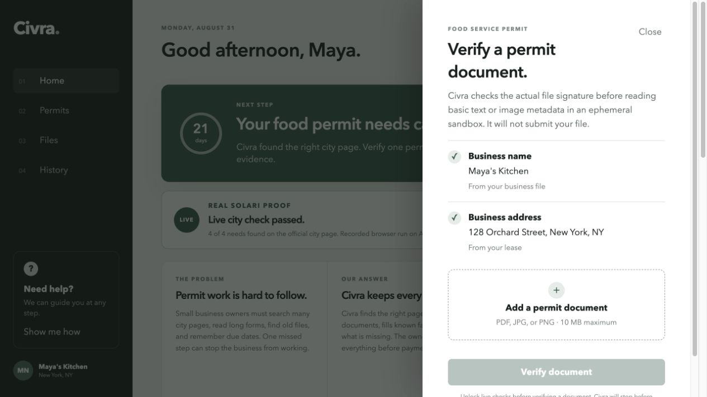
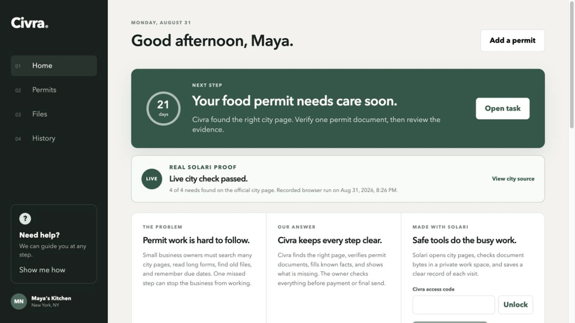

# Civra

**A safety-first permit-readiness tool for small-business owners.**

Civra does not pretend an AI answer is correct. It checks an authoritative
government page, preserves the supporting evidence, and returns **unknown**
when it cannot trust the result.

[Live demo](https://civra-1033856783599.us-east1.run.app/) ·
[v0.2.1 release](https://github.com/yash27-lab/civra/releases/tag/v0.2.1) ·
[Architecture](docs/ARCHITECTURE.md) ·
[Safety decisions](docs/THREAT_MODEL.md) ·
[Recorded source proof](docs/LIVE_PROOF.md) ·
[Documentation index](docs/README.md)

> The public demo currently shows the recorded NYC source check. The document
> verification slice in this repository needs deployment before it appears at
> that URL.

### Short UI walkthrough

This short walkthrough shows the implemented owner dashboard and document
verification entry point. It does not claim to show a completed live sandbox
run.

## Problem

Small business owners must navigate changing city pages, long forms, old
documents, and critical renewal dates. A confident but unsupported answer is
worse than no answer.

## What is real today

- A fixed, recorded Solari browser run verifies the official NYC Food Service
  Establishment Permit page. URL, title, page markers, and requirement phrases
  must all agree; otherwise every result is unknown.
- Each found city requirement includes the matching official-page excerpt,
  source timestamp, and a persisted source snapshot with normalized fingerprint
  and change status. An unlocked owner can open a saved snapshot to inspect its
  recorded requirement evidence without launching another browser run.
- A protected document route accepts a PDF, JPEG, or PNG up to 10 MB, checks
  its magic bytes before any extraction, and verifies those bytes a second time
  in an ephemeral Solari sandbox.
- The sandbox extracts PDF text with its local Poppler reader when available,
  with a conservative bounded Flate/literal fallback, plus basic PDF/image
  metadata. It matches that evidence against a versioned permit requirement
  set. Scanned PDFs and images without safely extracted text are unknown.
- The real Solari sandbox has been verified with a synthetic, valid,
  Flate-compressed one-page PDF. It extracted text with the bounded
  `flate-literal` path and correctly matched the three document-backed
  requirements; the non-document email requirement remained unknown.
- The original upload is never written to the Civra host filesystem. The
  sandbox is destroyed after every attempt, deleting its temporary file.
- Paid automation is gated by an HttpOnly, SameSite cookie, a server-only
  access code, per-session permit and document limits, a one-at-a-time sandbox
  limit, cached city checks, and failure cooldowns. The owner sees remaining
  check budgets before starting another paid action.
- The owner dashboard ranks tracked renewal dates for review, persists
  reminder names and dates in the same browser only, and can download a local
  calendar review file; it never sends a notification, files a renewal, or
  takes any external action.

## What Civra deliberately does not do

- Submit a form, pay a fee, sign in to a city account, or store portal
  credentials.
- Treat an unavailable extraction, a scanned document, or a changed official
  page as a successful result.
- Claim that a document match proves a complete or current permit. “Ready”
  means only that this document contains the expected evidence and still needs
  owner review.

## Architecture

    Owner browser
        ├── access code ──> Civra server ──> recorded Solari browser
        │                                      └──> versioned city evidence
        └── PDF / JPG / PNG ──> byte-signature check ──> ephemeral sandbox
                                                              └──> evidence-backed checklist

The implementation is intentionally narrow: one NYC permit and one
reviewable document-verification flow. See [the full architecture](docs/ARCHITECTURE.md).

For local checks and safe contribution practices, see [CONTRIBUTING.md](CONTRIBUTING.md). For deployment readiness and non-secret health status, see the [operations runbook](docs/OPERATIONS.md) and [container deployment guide](docs/DEPLOYMENT.md).

## Run locally

Requirements: Node 20+ and a Solari API key for live checks.

    cp .env.example .env
    npm install
    set -a && source .env && set +a
    npm start

Open http://localhost:4173. The paid city and document checks require
SOLARI_API_KEY and CIVRA_ACCESS_CODE in the server environment.

## Test

    npm run check

The test suite covers the UI, fail-closed source verification, HTTP security
headers, access controls, byte-signature rejection, sandbox-route metering,
and evidence-report rendering. It injects the Solari boundary; it does not
spend a live API key. A separate synthetic-PDF smoke test has verified the
real sandbox integration without using an owner document.

## Requirement evidence

The current requirement set is **nyc-food-service-2026-09-01**, tied to the
recorded source result in public/live-proof.json. Every document response
returns that version, the official source URL, its recorded timestamp, and
the evidence or reason for each result.

## Planned next steps

1. Configure shared durable snapshot storage for multi-instance deployments.
2. Design opt-in cross-device renewal synchronization and notification
   delivery without weakening owner control.
3. Conduct and publish anonymized interviews with NYC food-business owners,
   accountants, and permit expediters.

## Publish this directory as the standalone repository

This folder contains the complete Civra application, local documentation,
license, CI, issue templates, and release history needed for a standalone
repository. Create an empty GitHub repository named civra, then publish this
directory as its own Git root. Do not migrate the Solari cookbook history or
claim its contributors as Civra contributors.
